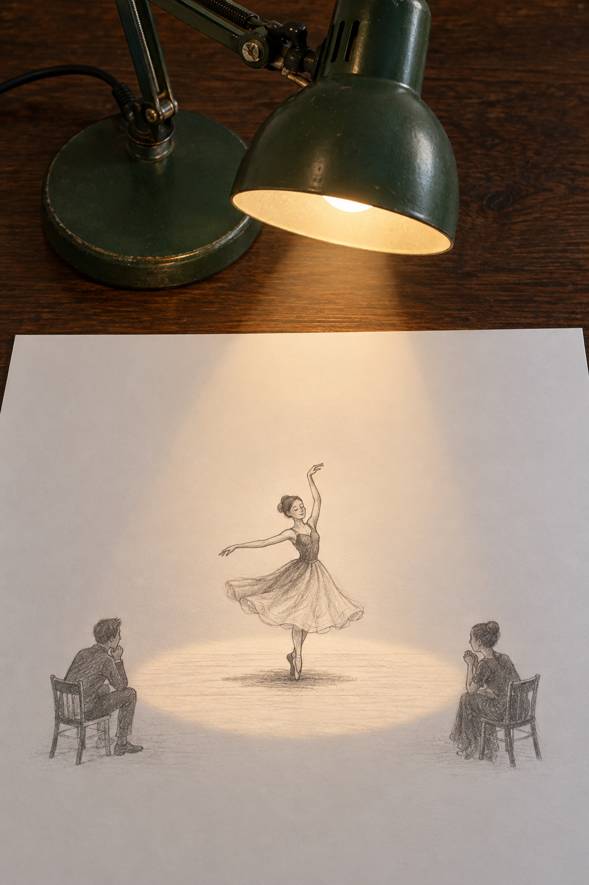
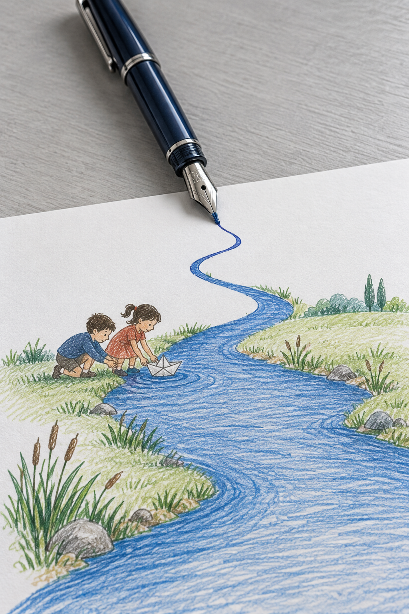
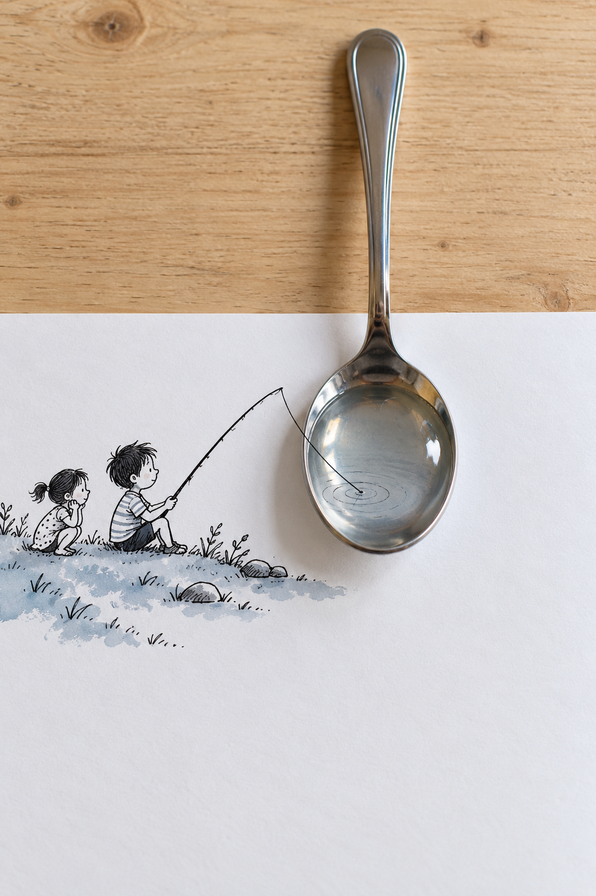

# 现实与手绘互动 Skill

让摄影中的真实物件参与一段平面手绘故事：灯光照亮画中舞台，钢笔墨迹流成画中河。画面需要看得见的摄影区、手绘区和跨界接点。

## 新手怎么用

把本目录放入 Codex 的 `skills/reality-illustration-interaction`，在对话中输入：

> 使用 `$reality-illustration-interaction`。我想让一件真实物品参与纸上的手绘故事。请先给我物件、画中用途、跨界接点、人物动作和画面分区，再按 Skill 生成一份可复制的完整生图提示词。生成前保存提示词，出图后按六项标准验收。

也可以提供一张有权使用的照片，并指出想保留的实物。此时要先确认图像端点**实际支持图片输入**；如果只提交文字，产物就是新生成的概念图，不能称为原照片编辑。

## 一张图的流程

1. 填好五项关系表，追踪实物起点、越界点、作用接点和终点；承重物的每个端点都要落到可见支撑面。
2. 选择一种画法，从 `SKILL.md` 的模板填写完整提示词，记录输入模式、素材来源、Skill 文件哈希和模型参数。
3. **先把最终提示词保存为文件并重新读取，再原样交给图像模型。** 需要改词时另存新版本；不要在模型调用里临时补写情节。
4. 按 `references/case-checklist.md` 的六项逐点验收。实物、双媒介边界或跨界接点失败的图保留为失败稿，不当作完成案例。

`SKILL.md` 是操作真源；`references/styles.md` 提供铅笔、墨线、彩铅和淡彩画法。生成端点、模型和尺寸可以按实际情况选择；示例使用 GPT Image 2.5，均为**文字生成概念图**。

## 已验证示例

- [台灯聚光提示词](examples/lamp-spotlight.txt)：真实灯光跨过纸边，照亮铅笔舞者。
- [钢笔成河提示词](examples/pen-river.txt)：真实笔尖接纸，蓝墨线连续成为彩铅河道。
- [汤匙池塘提示词](examples/spoon-pond.txt)：真实汤匙跨纸边，墨线钓竿落入匙碗。

这三张图各按六项标准通过；它们没有原照片输入，不能证明原图编辑保真。汤匙图的水层较浅，仍可优化。项目里的失败图、超时记录和完整验收表保存在 1010 期制作目录，公开仓库只提供可复用 Skill 与通过的示例。

## 许可证

MIT。第三方素材仍遵循其各自许可证。
